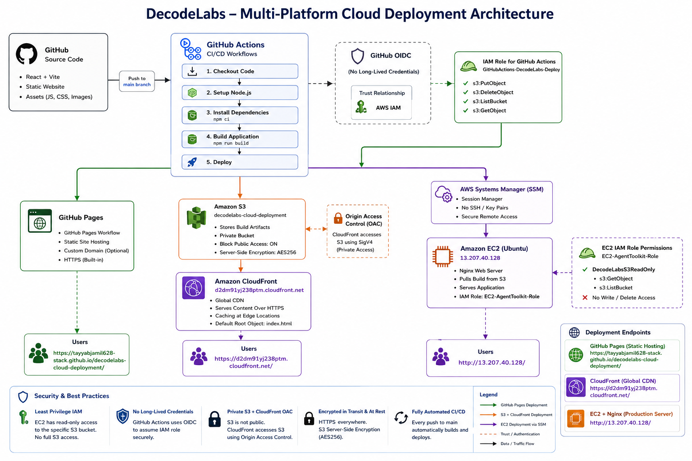
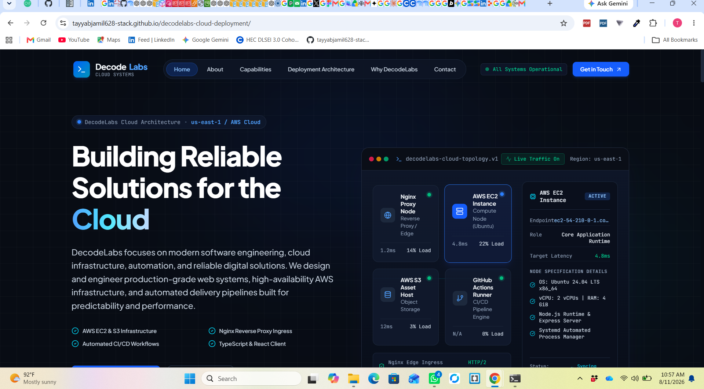
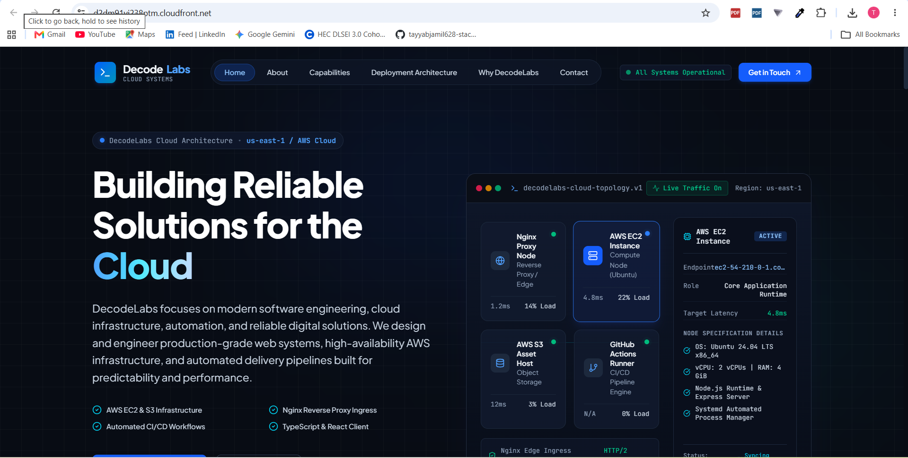
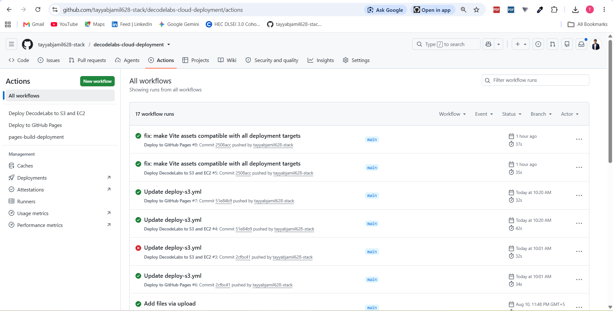

# DecodeLabs Cloud Deployment

[](https://github.com/tayyabjamil628-stack/decodelabs-cloud-deployment/actions/workflows/deploy-pages.yml)
[](https://github.com/tayyabjamil628-stack/decodelabs-cloud-deployment/actions/workflows/deploy-s3.yml)
[](LICENSE)
[](package.json)

A multi-target cloud deployment project demonstrating automated CI/CD delivery of a React + TypeScript single-page application to GitHub Pages, Amazon S3 (fronted by Amazon CloudFront), and an Ubuntu EC2 instance running Nginx — all triggered from a single `git push` to `main`.

## Project Overview

DecodeLabs is a static single-page application built with React 19, TypeScript, and Vite. The engineering focus of this repository isn't the frontend — it's the delivery pipeline: Both workflows build the same source revision independently, the AWS workflow then uses S3 as the shared deployment artifact for CloudFront and EC2. The same application is deployed through three delivery endpoints, with Amazon S3 acting as the shared artifact origin for CloudFront and EC2,through two GitHub Actions workflows, using GitHub's OIDC identity provider instead of long-lived AWS credentials.

This setup exists to demonstrate, in one place:

- Multi-target static site deployment from a single build artifact
- Keyless AWS authentication from CI using GitHub OIDC + an IAM role
- Agentless EC2 deployment via AWS Systems Manager (no SSH keys)
- CDN delivery through S3 + CloudFront
- Parallel, independently-triggered GitHub Actions workflows

AWS services involved: **IAM (OIDC role)**, **S3**, **CloudFront**, **EC2**, **Systems Manager (SSM)**. See [`docs/aws-infrastructure.md`](docs/aws-infrastructure.md) for details on each.

## Live Deployments

| Deployment | Platform | Link | Status |
|---|---|---|---|
| GitHub Pages | GitHub Pages | [tayyabjamil628-stack.github.io/decodelabs-cloud-deployment](https://tayyabjamil628-stack.github.io/decodelabs-cloud-deployment/) | Operational |
| CloudFront | AWS CloudFront | [d2dm91yj238ptm.cloudfront.net](https://d2dm91yj238ptm.cloudfront.net/) | Operational |
| EC2 | AWS EC2 + Nginx | [13.207.40.128](http://13.207.40.128) | Operational |

Amazon S3 (`decodelabs-cloud-deployment`) is not a standalone public deployment target — it's the build-artifact origin that CloudFront serves from and that EC2 pulls its files from during deployment. There is no separate S3 static-website URL for this project.

> **Note:** the EC2 endpoint is served over plain HTTP; your browser will show a "Not secure" warning. This is expected — see [Future Improvements](#future-improvements).

## Deployment Architecture



A push to `main` triggers two independent GitHub Actions workflows in parallel:

1. **`deploy-pages.yml`** builds the app and publishes it directly to GitHub Pages.
2. **`deploy-s3.yml`** builds the app, authenticates to AWS via GitHub OIDC (assuming the `GitHubActions-DecodeLabs-Deploy` IAM role), syncs the build to the `decodelabs-cloud-deployment` S3 bucket, then sends a shell command to the EC2 instance via AWS Systems Manager that pulls the same files from S3 and reloads Nginx.

CloudFront serves the S3 bucket's contents at a separate distribution URL. There is no step in either workflow that invalidates the CloudFront cache or explicitly provisions the CloudFront distribution — that configuration was not found in the repository and is treated as out-of-band AWS console setup. See [`docs/architecture.md`](docs/architecture.md) for the full breakdown, including what could and couldn't be verified from the repository.

## CI/CD Pipeline

```
Developer
    │
    ▼
git push (main)
    │
    ├──────────────────────────────┐
    ▼                               ▼
deploy-pages.yml                deploy-s3.yml
    │                               │
npm install                     npm ci
    │                               │
npm run build                   npm run build
    │                               │
GitHub Pages                    GitHub OIDC → IAM Role
                                     │
                                     ▼
                                 aws s3 sync → S3 bucket
                                     │
                                     ▼
                            aws ssm send-command → EC2
                                     │
                                     ▼
                            s3 sync (on host) → /var/www/decodelabs
                                     │
                                     ▼
                                nginx -t && systemctl reload nginx
```

Full workflow-by-workflow breakdown: [`docs/ci-cd.md`](docs/ci-cd.md).

## Technologies Used

**Application**
- React 19, TypeScript (strict mode)
- Vite 6
- Tailwind CSS v4
- Lucide React (icons), Motion (animation)

**CI/CD**
- GitHub Actions
- GitHub Pages (`actions/deploy-pages`)
- GitHub OIDC (`aws-actions/configure-aws-credentials`)

**AWS**
- IAM (OIDC identity federation, IAM role)
- Amazon S3
- Amazon CloudFront
- Amazon EC2 (Ubuntu 24.04 LTS)
- AWS Systems Manager (Session Manager / `send-command`)
- Nginx (web server on EC2)

Only technologies confirmed in `package.json`, the two workflow files, or the live deployments are listed here. The repository's `package.json` also lists `@google/genai`, `express`, and `dotenv` as dependencies — these are unused scaffolding left over from the project's origin as a Google AI Studio template; the app itself is a static Vite build with no server-side runtime, so they are not listed above. See [Problems Found](docs/troubleshooting.md).

## Repository Structure

```
.github/
  workflows/
    deploy-pages.yml     # Build + publish to GitHub Pages
    deploy-s3.yml        # Build + deploy to S3, then EC2 via SSM

src/                     # React + TypeScript application source
public/                  # Static assets (robots.txt, sitemap.xml)
docs/                    # Project documentation (this package)
  images/                # Architecture diagram + live screenshots
package.json
vite.config.ts
tsconfig.json
LICENSE
README.md
```

## Security

**Implemented:**
- GitHub OIDC federation — the `deploy-s3.yml` workflow assumes an IAM role via short-lived, workflow-scoped OIDC tokens; no long-lived AWS access keys are stored in GitHub Secrets.
- EC2 deployment via AWS Systems Manager `send-command` — no SSH keys or open port 22 required for deployment.
- `.gitignore` excludes `.env*` files from version control (with `.env.example` explicitly allowed).

**Recommended future improvements:**
- HTTPS/TLS on the EC2 endpoint (currently served over plain HTTP).
- CloudFront cache invalidation as an explicit pipeline step.
- Scoping the `GitHubActions-DecodeLabs-Deploy` IAM role/S3 bucket policy to least privilege if not already done (not verifiable from the repository alone).

Full breakdown: [`docs/security.md`](docs/security.md).

## Screenshots

### GitHub Pages


### CloudFront


### EC2


### GitHub Actions


More detail on each screenshot: [`docs/screenshots.md`](docs/screenshots.md).

## Learning Outcomes

- Designing and running parallel GitHub Actions workflows from a single trigger
- Configuring GitHub OIDC federation to AWS IAM (credential-free CI)
- S3 as a build-artifact origin for CloudFront
- Agentless server deployment using AWS Systems Manager instead of SSH
- Nginx configuration, reload, and validation as part of an automated deploy
- Diagnosing and fixing real CI/CD failures (see [`docs/troubleshooting.md`](docs/troubleshooting.md))

## Future Improvements

- Custom domain with HTTPS across all four deployment targets
- TLS termination on the EC2 instance (currently HTTP-only)
- Explicit CloudFront cache invalidation step in `deploy-s3.yml`
- Infrastructure as Code (e.g., Terraform/CloudFormation) for the S3/CloudFront/EC2/IAM resources, which are currently provisioned outside this repository
- Deployment health checks and rollback on failure
- Centralized logging/monitoring (CloudWatch) and deployment notifications

## License

Released under the [MIT License](LICENSE).
