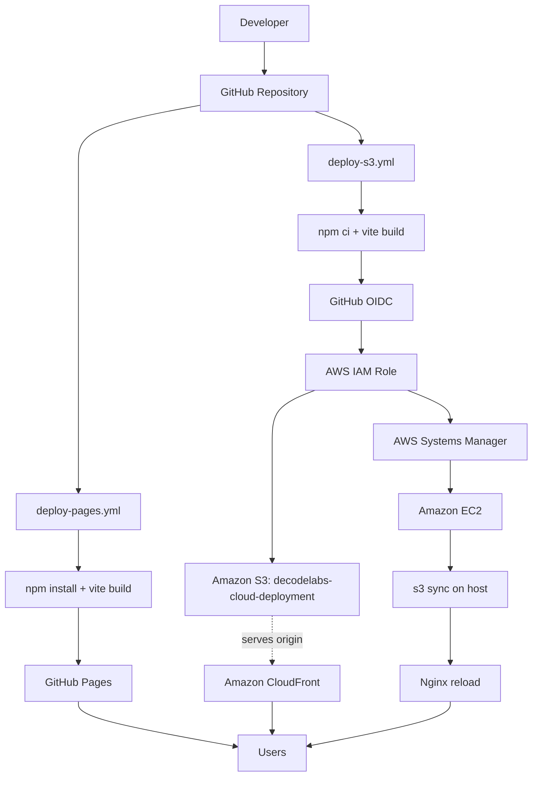

# Architecture

## Overview

DecodeLabs is a static single-page application (React + Vite) deployed to four independent targets from one repository. Two GitHub Actions workflows handle delivery: one publishes directly to GitHub Pages, the other builds and pushes to AWS (S3 → CloudFront, and S3 → EC2 via SSM).

## Real Architecture Diagram

This diagram is the authoritative visual reference for the project and was supplied directly by the maintainer. The sections below cross-check it against what is actually present in the repository.

## Components

### 1. GitHub Repository
Source of truth for the application code and both workflow definitions. A push to `main` is the sole trigger for both pipelines.

### 2. GitHub Actions
Two independent workflow files exist in `.github/workflows/`:
- `deploy-pages.yml` — builds and publishes to GitHub Pages.
- `deploy-s3.yml` — builds, then deploys to S3 and EC2.

Both run on `ubuntu-latest` with Node.js 24.

### 3. GitHub OIDC
`deploy-s3.yml` requests `id-token: write` permission and uses `aws-actions/configure-aws-credentials@v4` to exchange a GitHub-issued OIDC token for temporary AWS credentials — no static AWS access keys are stored as GitHub Secrets.

### 4. AWS IAM
The workflow assumes `arn:aws:iam::<account-id>:role/GitHubActions-DecodeLabs-Deploy` in region `ap-south-1`. The account ID is present in the workflow file itself (not treated as a secret by AWS, but intentionally not repeated in full here). The diagram lists specific permissions granted to this role (`s3:PutObject`, `s3:DeleteObject`, `s3:ListBucket`, `s3:GetObject`) and a separate EC2 instance role (`DecodeLabsS3ReadOnly`, read-only). These permission sets are as supplied in the diagram; the underlying IAM policy JSON is not present in the repository, so the exact policy statements are **not verified from the available project sources** — only the role names and the actions performed by the workflow (sync to S3, SSM commands) are directly confirmed.

### 5. Amazon S3
Bucket: `decodelabs-cloud-deployment`, region `ap-south-1`. Receives the Vite build output via `aws s3 sync dist/ s3://decodelabs-cloud-deployment --delete`. Acts as the origin for CloudFront and as the source EC2 pulls from during deployment.

### 6. Amazon CloudFront
Distribution `d2dm91yj238ptm.cloudfront.net` serves the S3 bucket's contents publicly over HTTPS. **Not verified from the repository:** how the distribution is configured, whether Origin Access Control is enabled, or whether cache invalidation happens on deploy — no CloudFront-related step exists in either workflow. The diagram documents OAC and default-root-object behavior; this is taken as supplied evidence, but cannot be cross-checked against workflow code since CloudFront isn't touched by CI.

### 7. AWS Systems Manager (SSM)
`deploy-s3.yml` uses `aws ssm send-command` with the `AWS-RunShellScript` document to run deployment commands on the EC2 instance, then polls with `aws ssm wait command-executed` and `aws ssm get-command-invocation`. This confirms SSM is the actual mechanism used to reach EC2 — there is no SSH step anywhere in the workflow.

### 8. Amazon EC2
Instance `i-0306fac86dc3753d3`, public IP `13.207.40.128`. The SSM command downloads the build from S3 to `/tmp/decodelabs-deploy`, verifies `index.html` exists, copies it to `/var/www/decodelabs`, sets ownership to `www-data`, and reloads Nginx. Ubuntu 24.04 LTS is stated in the diagram; this is not independently verifiable from the workflow (which never runs an OS-version command), so it is reported as diagram-sourced, not workflow-verified.

### 9. Nginx
Serves `/var/www/decodelabs` on the EC2 instance. The workflow runs `nginx -t` (config test) before `systemctl reload nginx`, confirming Nginx is the actual web server in use — this isn't just asserted, it's exercised by the pipeline itself.

## Traffic Flow

## Security Boundaries

- CI has no long-lived AWS credentials; only a short-lived, OIDC-issued session scoped to the `GitHubActions-DecodeLabs-Deploy` role.
- EC2 is never reached over SSH from CI — only via SSM, which does not require an open inbound port for deployment.
- The build artifact is the single source deployed everywhere; S3 is the shared handoff point between the CloudFront path and the EC2 path.

## Potential Failure Points

- If `aws s3 sync` fails or is incomplete, the SSM script explicitly checks for `index.html` on the EC2 host and exits non-zero if it's missing — this is a real safeguard present in `deploy-s3.yml`, not a hypothetical.
- `nginx -t` runs before `systemctl reload nginx`, so a malformed Nginx config (not expected in this setup, but theoretically possible if `/var/www/decodelabs` content changed) would block the reload — again, this is enforced in the workflow itself.
- CloudFront is not part of either workflow, so a stale cache after deploy is a realistic gap: **not verified** whether invalidation happens by any other means.
- Both workflows run independently on the same push; a `deploy-pages.yml` failure has no effect on `deploy-s3.yml` succeeding, and vice versa — they are not chained.

## Future Improvements

See [README → Future Improvements](../README.md#future-improvements) and [`security.md`](security.md) for the full list.
